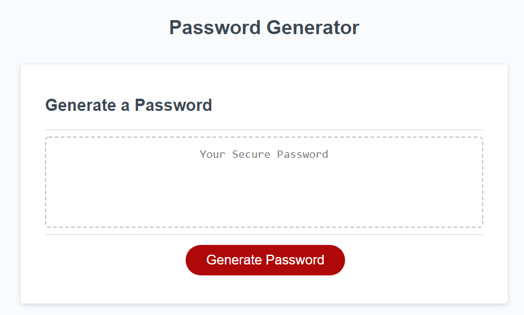

# password-generator

## Description
A Javascript exercise that generates a random password based on the following criteria:
* Length of password (8-128 characters)
* Character types (lowercase, uppercase, numbers, and special)

It provides practice in input validation, random number generation, and string processing.

## Screenshot

## Deployment
The website has been deployed on GitHub as http://malenchite.github.io/password-generator

## Credits
All HTML and CSS design was provided as part of an assignment for the UNC Coding Bootcamp
